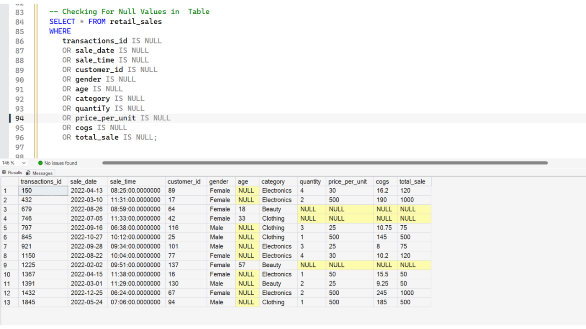
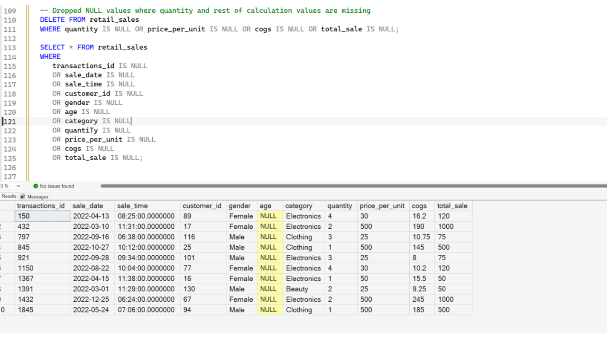
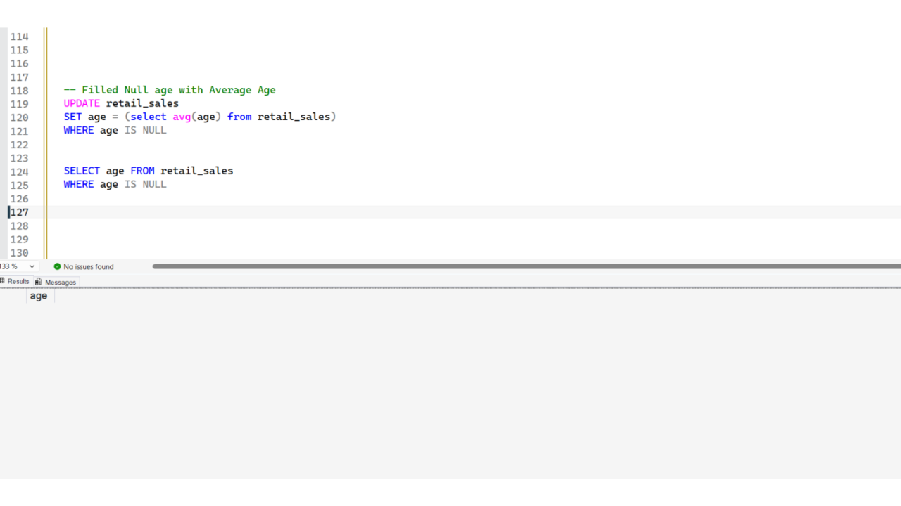
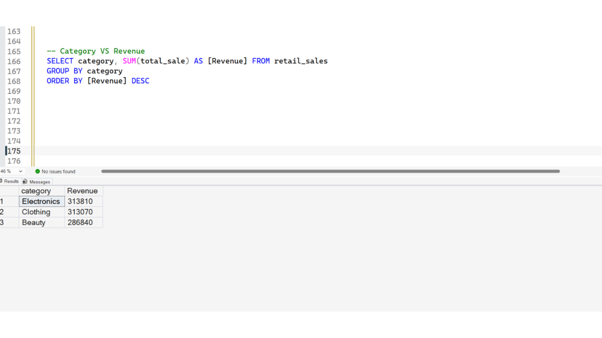
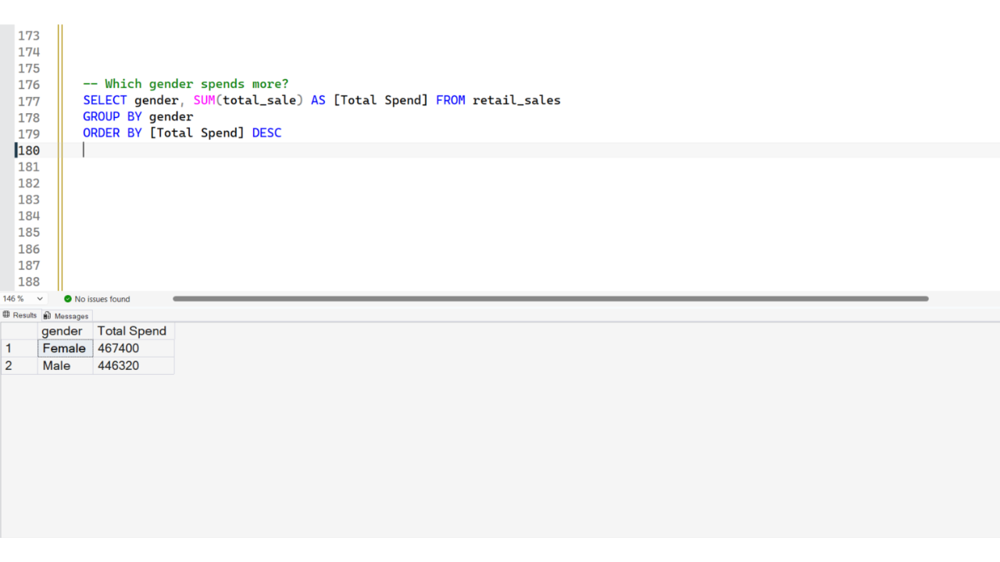
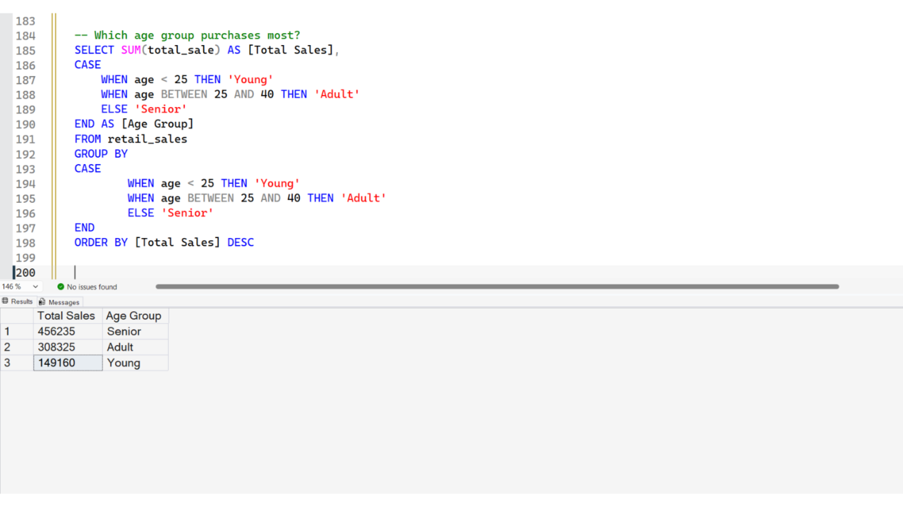
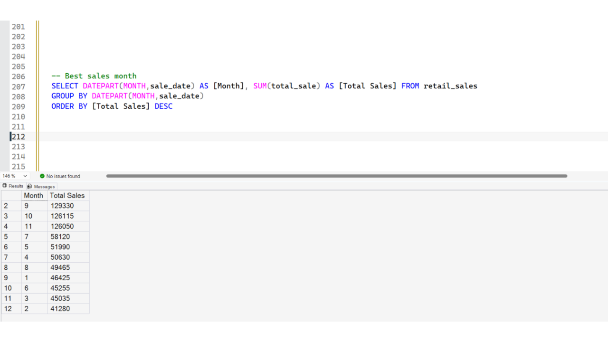
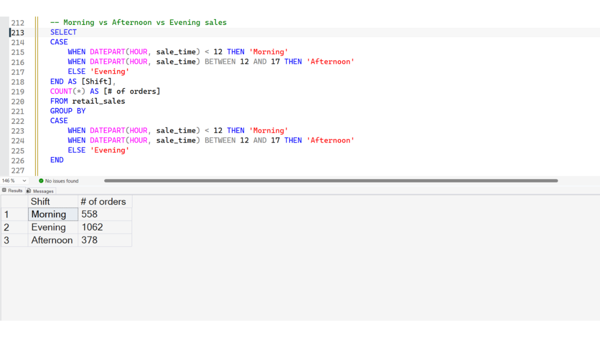
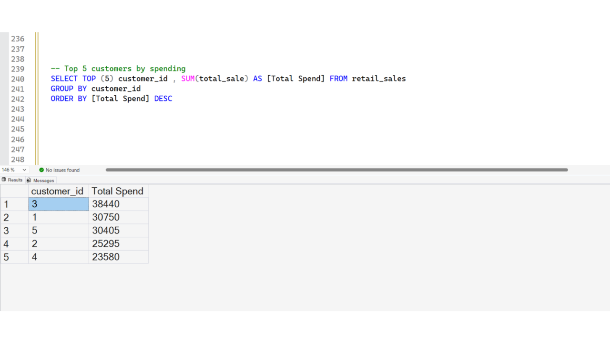
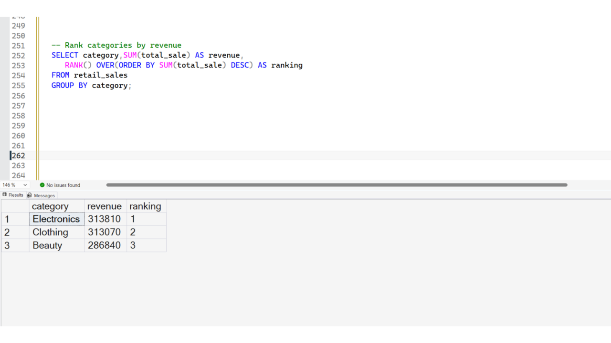

# SQL Retail Sales Analysis

## Project Overview
This project focuses on analyzing retail sales data using SQL Server.  

The goal of the project was:
- Database creation
- CSV data import
- Data cleaning
- Exploratory Data Analysis (EDA)
- Business problem solving
- Revenue analysis

---
# Dataset Information
The dataset contains retail transaction information such as:
- Transaction ID
- Sale Date & Time
- Customer ID
- Gender
- Age
- Product Category
- Quantity
- Price Per Unit
- COGS (Cost of Goods Sold)
- Total Sale

---

# Tools Used

- SQL Server Management Studio (SSMS)
- SQL

---

# Database Creation

Created a new database for the project.

```sql
CREATE DATABASE db_retail_sales;
```

Then selected the database for use:

```sql
USE db_retail_sales;
```

# Table Creation

Created the `retail_sales` table with appropriate columns and data types.

```sql
CREATE TABLE retail_sales
(
    transactions_id INT PRIMARY KEY,
    sale_date DATE,	
    sale_time TIME,
    customer_id INT,	
    gender VARCHAR(10),
    age INT,
    category VARCHAR(35),
    quantity INT,
    price_per_unit FLOAT,	
    cogs FLOAT,
    total_sale FLOAT
);
```


---

# Importing CSV Data

Imported the retail sales CSV dataset into SQL Server using BULK INSERT.

```sql
BULK INSERT retail_sales
FROM 'CompleteFilePath' --For example: 'C:\Users\Downloads\retail_sales.csv'
WITH (
    FIRSTROW = 2,
    FIELDTERMINATOR = ',',
    ROWTERMINATOR = '\n'
);
```
---

# Data Overview

Performed initial data exploration to better understand the dataset structure and quality.

## Data Overview Tasks

### ✔ Checked column names and data types

```sql
SELECT Column_name, data_type
FROM information_schema.columns
WHERE TABLE_NAME = 'retail_sales';
```

### ✔ Checked total number of records

```sql
SELECT COUNT(*)
FROM retail_sales;
```

### ✔ Checked data duplication

```sql
SELECT transactions_id, COUNT(*)
FROM retail_sales
GROUP BY transactions_id
HAVING COUNT(*) > 1;
```

### ✔ Explored gender distribution

```sql
SELECT gender, COUNT(*)
FROM retail_sales
GROUP BY gender;
```

### ✔ Checked unique gender values

```sql
SELECT DISTINCT gender
FROM retail_sales;
```

### ✔ Checked invalid ages

```sql
SELECT age
FROM retail_sales
WHERE age < 1;
```

### ✔ Checked categories and record counts

```sql
SELECT category, COUNT(*)
FROM retail_sales
GROUP BY category;
```

### ✔ Checked negative quantity or price values

```sql
SELECT *
FROM retail_sales
WHERE quantity < 0 OR price_per_unit < 0;
```

### ✔ Checked NULL values

```sql
SELECT *
FROM retail_sales
WHERE 
   transactions_id IS NULL
   OR sale_date IS NULL
   OR sale_time IS NULL
   OR customer_id IS NULL
   OR gender IS NULL
   OR age IS NULL
   OR category IS NULL
   OR quantity IS NULL
   OR price_per_unit IS NULL
   OR cogs IS NULL
   OR total_sale IS NULL;
```

---
# Data Cleaning

Performed cleaning operations to improve data quality.

## Cleaning Tasks

### ✔ Removed rows with missing calculation-related values

```sql
DELETE FROM retail_sales
WHERE quantity IS NULL
   OR price_per_unit IS NULL
   OR cogs IS NULL
   OR total_sale IS NULL;
```


### ✔ Filled missing age values using average age

```sql
UPDATE retail_sales
SET age = ( SELECT AVG(age) FROM retail_sales )
WHERE age IS NULL;
```


---
# Exploratory Data Analysis (EDA)

Performed SQL analysis to answer business-related questions.

---

## Business Questions Solved

### 1. Total number of sales

```sql
SELECT COUNT(total_sale)
FROM retail_sales;
```

---

### 2. Total revenue generated

```sql
SELECT SUM(total_sale)
FROM retail_sales;
```

---

### 3. Average customer age

```sql
SELECT AVG(age)
FROM retail_sales;
```
---

### 4. Highest and lowest sales

```sql
SELECT MAX(total_sale), MIN(total_sale)
FROM retail_sales;
```

---

### 5. Category vs Revenue

```sql
SELECT category, SUM(total_sale) AS revenue
FROM retail_sales
GROUP BY category
ORDER BY revenue DESC;
```

---

### 6. Which gender spends more?

```sql
SELECT gender, SUM(total_sale) AS total_spend
FROM retail_sales
GROUP BY gender
ORDER BY total_spend DESC;
```

---

### 7. Which age group purchases the most?

Used CASE statements to segment customers into:
- Young
- Adult
- Senior

```sql
SELECT
    SUM(total_sale) AS total_sales,

    CASE
        WHEN age < 25 THEN 'Young'
        WHEN age BETWEEN 25 AND 40 THEN 'Adult'
        ELSE 'Senior'
    END AS age_group

FROM retail_sales

GROUP BY
    CASE
        WHEN age < 25 THEN 'Young'
        WHEN age BETWEEN 25 AND 40 THEN 'Adult'
        ELSE 'Senior'
    END

ORDER BY total_sales DESC;
```

---

### 8. Best sales month

```sql
SELECT DATEPART(MONTH, sale_date) AS month,
       SUM(total_sale) AS total_sales
FROM retail_sales
GROUP BY DATEPART(MONTH, sale_date)
ORDER BY total_sales DESC;
```

---

### 9. Morning vs Afternoon vs Evening sales

```sql
SELECT
    CASE
        WHEN DATEPART(HOUR, sale_time) < 12 THEN 'Morning'
        WHEN DATEPART(HOUR, sale_time) BETWEEN 12 AND 17 THEN 'Afternoon'
        ELSE 'Evening'
    END AS shift,

    COUNT(*) AS total_orders

FROM retail_sales

GROUP BY
    CASE
        WHEN DATEPART(HOUR, sale_time) < 12 THEN 'Morning'
        WHEN DATEPART(HOUR, sale_time) BETWEEN 12 AND 17 THEN 'Afternoon'
        ELSE 'Evening'
    END;
```

---

### 10. Top 5 customers by spending

```sql
SELECT TOP 5
    customer_id,
    SUM(total_sale) AS total_spend
FROM retail_sales
GROUP BY customer_id
ORDER BY total_spend DESC;
```

---

### 11. Average order value per category

```sql
SELECT category,
       ROUND(AVG(total_sale), 2) AS average_order_value
FROM retail_sales
GROUP BY category;
```

---

### 12. Rank categories by revenue

```sql
SELECT category,
       SUM(total_sale) AS revenue,

       RANK() OVER (
           ORDER BY SUM(total_sale) DESC
       ) AS ranking

FROM retail_sales
GROUP BY category;
```

---

# SQL Concepts Used

- Database Creation
- Table Creation
- BULK INSERT
- Data Cleaning
- NULL Handling
- Aggregate Functions
- GROUP BY
- ORDER BY
- CASE Statements
- Window Functions
- DATEPART
- Exploratory Data Analysis

---

# Key Insights

- Female customers spent more than male customers.
- Evening sales periods contained the largest number of transactions.
- Sales trends varied across different months.
- Revenue ranking helped identify top-performing categories.

---

# Project Structure

```text
sql-retail-sales-analysis/
│
├── screenshots/
├── README.md
├── retail_sales.csv
└── retail_sales.sql
```

---

# Future Improvements

- Build Power BI dashboard
- Perform Python EDA
- Add advanced SQL queries

---

# Author
Noman Ahmad Siddiqui
